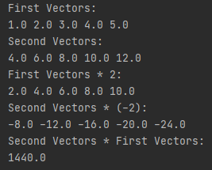
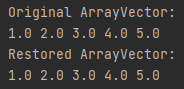

# Отчет по Учебному практическому заданию 2_1  
  
## Задание №1.

"Создайте класс Vectors, содержащий статические методы работы с
векторами:"

* умножения вектора на скаляр,
* сложения двух векторов,
* нахождения скалярного произведения двух векторов.
    
### Структура программы:  
* Класс Main 
* Класс Vectors
    
### Примеры работы

## Задание №2.

"Модифицируйте класс Vectors, добавив в него новые методы:

* записи вектора в байтовый поток void outputVector(Vector v,
OutputStream out),
* чтения вектора из байтового потока Vector
inputVector(InputStream in),
* записи вектора в символьный поток void writeVector(Vector
v, Writer out),
* чтения вектора из символьного потока Vector
readVector(Reader in).

В обоих случаях записанный вектор должен представлять собой
последовательность чисел, первым из которых является размерность
вектора, а остальные числа являются значениями координат вектора.
В случае символьного потока рекомендуется считать, что один вектор
записывается в одну строку (числа разделены пробелами). Для чтения
вектора из символьного потока рекомендуется использовать класс
StreamTokenizer.
Проверьте возможности методов (в методе main), в качестве реальных
потоков используя файловые потоки, а также потоки System.in и
System.out.
"  

### Структура программы:  
* Класс Main
* Класс ModifiedVectors

## Задание №3.  
"Модифицируйте классы ArrayVector и LinkedListVector
(основанные на массиве и на связном списке) таким образом, чтобы они
были сериализуемыми.
Продемонстрируйте возможности сериализации (в методе main),
записав в файл объект, затем считав и сравнив с исходным (по
сохраненным значениям)."  
    
### Структура программы:  
* Класс Main
* Класс SerializedArrayVector

### Примеры работы

